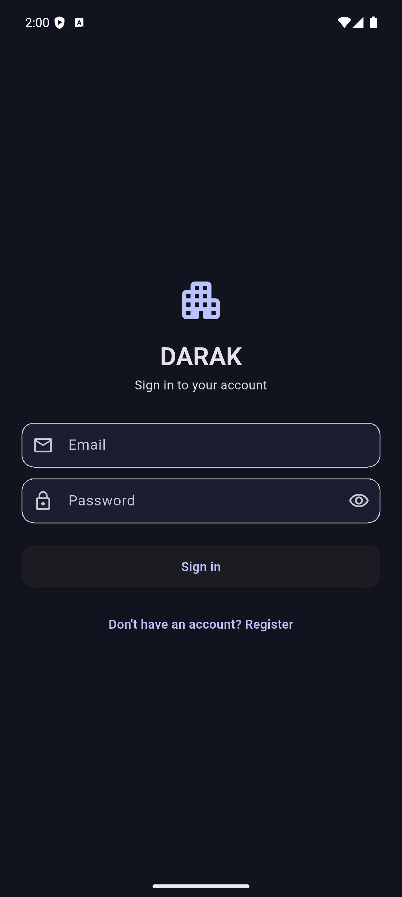
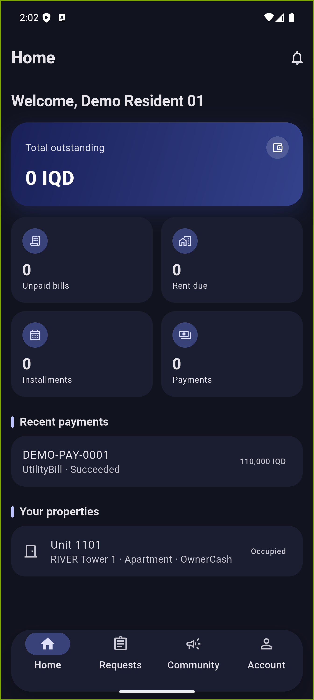
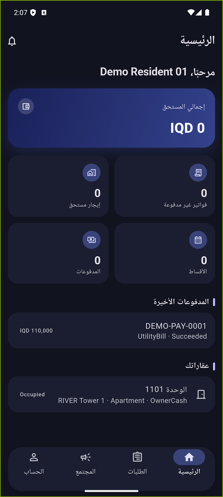

# DARAK

A cross-role residential compound management app built with Flutter. DARAK serves both **residents** (billing, maintenance, community, visitor management) and **compound guards** (gate access control for visitors and contractors), backed by a .NET REST API.

<p align="center">
  
  
  
</p>

## Overview

DARAK is the resident- and guard-facing mobile client for a compound/property management backend. A single codebase serves two distinct roles, each routed to its own shell after login based on the authenticated user's role claims:

- **Resident** — view and pay bills, track rent and installments, request maintenance, manage visitor passes, browse community announcements and polls, file complaints, and handle financial disputes and violation appeals.
- **Guard** — look up today's expected visitors and contractors, verify access codes, check people in and out, deny entry with a reason, and review the access log — all scoped server-side to the guard's assigned compound(s).

The app is fully localized in **English and Arabic**, with full RTL layout support.

## Features

### Resident
- **Dashboard** — outstanding balance, unpaid bills, rent due, installments, recent payments, and owned/rented properties at a glance.
- **Billing** — utility bills, rent invoices, installment schedules, and payment history, each with detail views and status tracking.
- **Maintenance requests** — submit and track requests with status and category.
- **Visitor passes** — issue passes with a shareable access code, track status through approval, check-in, and check-out.
- **Community** — announcements feed and polls with voting.
- **Complaints** — submit and follow up on complaints.
- **Financial disputes** — raise a dispute against a bill or payment and track its resolution.
- **Violation fines & appeals** — view fines issued against a unit and submit an appeal.
- **Family members & emergency contacts** — manage household member and emergency contact records.
- **Documents** — browse and download compound/unit-related documents.
- **Account & settings** — profile summary, theme (system/light/dark), and language (English/Arabic), persisted across sessions.

### Guard
- **Visitors today** — paged list of the day's expected visitor passes, scoped to the guard's compound.
- **Verify access code** — manually enter a visitor's access code to look up their pass.
- **Check-in / check-out / deny** — action a visitor pass with optional notes or a denial reason.
- **Access log** — full audit trail of check-in/out/verify/deny events per pass.
- **Contractors today** — paged list of the day's expected contractor work permits, with risk-level and status indicators.
- **Contractor check-in / check-out** — action a contractor permit with optional notes.

## Tech stack

- **Flutter** / Dart (SDK ^3.8.1)
- **Riverpod** (`flutter_riverpod`) — state management via `NotifierProvider` / `AsyncNotifier` / family providers
- **go_router** — declarative routing with role-based redirects
- **dio** — HTTP client
- **flutter_secure_storage** — secure token persistence
- **intl** + Flutter's ARB-based localization (`flutter gen-l10n`) — English/Arabic, full RTL support
- **flutter_launcher_icons** — adaptive app icon generation

Backend: a separate .NET (ASP.NET Core) REST API, run via Docker Compose, providing role-scoped endpoints for both residents and guards (repository not included here).

## Architecture

The app follows a feature-first structure:

```
lib/
  core/                # Shared infrastructure
    config/            # API base URL / environment config
    network/            # Dio-based ApiClient, error handling
    router/             # go_router setup, routes, role-based redirect
    storage/             # Secure storage helpers
    theme/               # Material theme, color seed, gradients
    widgets/             # Shared widgets (status chips, paged list view, empty/error states)
  features/
    auth/                # Login, session restore, role-aware AppUser model
    dashboard/           # Resident dashboard
    account/             # Bills, rent, installments, payments, violation fines
    maintenance/         # Maintenance requests
    visitor_passes/      # Resident-side visitor pass management
    announcements/       # Community announcements
    polls/               # Community polls
    complaints/          # Complaints
    financial_disputes/  # Financial disputes
    violation_appeals/   # Violation appeals
    family_contacts/     # Family members & emergency contacts
    documents/           # Document browsing
    notifications/       # In-app notifications
    settings/            # Theme + locale preferences
    guard/               # Guard role: visitor & contractor access control
    shell/               # Resident/Guard bottom-nav shells
  l10n/                  # ARB files (app_en.arb, app_ar.arb) + generated localizations
```

Each feature follows the same internal layering: `data/` (models + API client) → `presentation/providers/` (Riverpod controllers) → `presentation/screens/` (UI). Paged lists share a single `PagedListNotifier` + `PagedListView` widget pair app-wide.

Routing is role-based: on login, `AppUser.roles` determines whether the user lands in the resident shell (`ResidentShell`, 4 tabs) or the guard shell (`GuardShell`, 3 tabs). Each shell is an `IndexedStack` behind a floating pill-shaped bottom navigation bar.

## Localization

The entire app — every screen, status label, enum value, and validation message — is available in English and Arabic, switchable at runtime from Settings and persisted across restarts. Arabic renders fully right-to-left, including manually-mirrored icons where Flutter's automatic `Directionality` mirroring doesn't cover a widget (e.g. `chevron_right`).

## Getting started

### Prerequisites
- Flutter SDK (^3.8.1)
- A running instance of the DARAK backend API (see that repository's setup instructions), or your own `--dart-define=API_BASE_URL=...` target

### Setup

```bash
flutter pub get
flutter gen-l10n
```

### Run

```bash
# Android emulator (backend assumed reachable at 10.0.2.2:8080, e.g. via Docker Compose)
flutter run

# Custom backend URL
flutter run --dart-define=API_BASE_URL=https://your-api-host/api
```

### Regenerate the app icon (after changing `assets/icon/`)

```bash
dart run flutter_launcher_icons
```

## License

This project does not currently declare a license. All rights reserved by the author unless stated otherwise.
